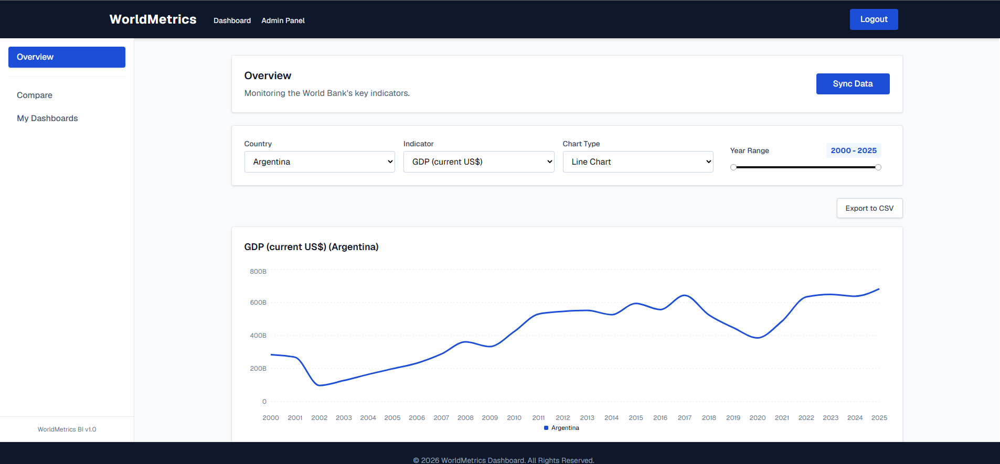
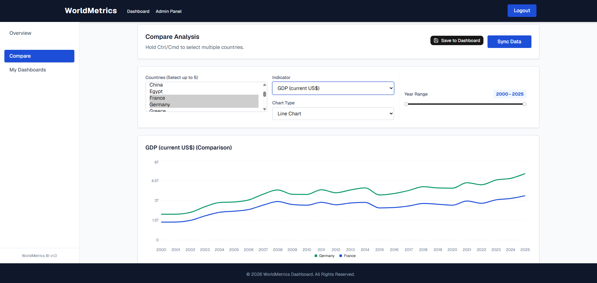
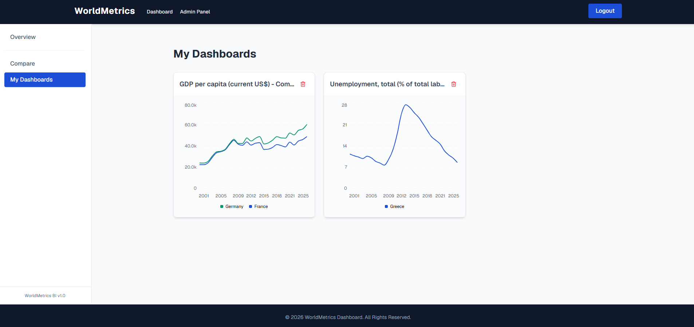
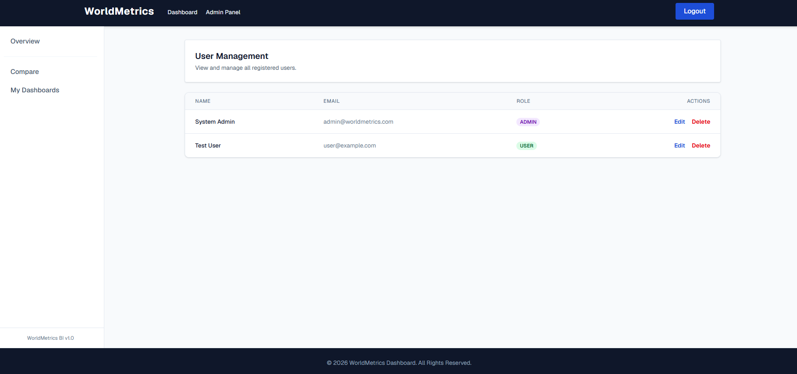

## World Metrics Dashboard
This repository contains the final project for the Athens University of Economics and Business (AUEB) Coding Factory Bootcamp. It is a full-stack Business Intelligence application implementing a layered architecture (Repository/Service/Controller) and Domain-Driven Design principles.

## Features & Functionality
The application provides a robust, interactive interface for tracking, visualizing, and analyzing global economic and demographic metrics.

## Video Demonstration

https://github.com/user-attachments/assets/56b8d66e-a86e-462c-adac-355cab60a747

## Application Screenshots

**Overview Dashboard**

**Comparative Analysis**

**My Dashboards (Saved Widgets)**

**Admin Panel - User Management**

**End-User Experience:**
*   **Interactive Data Visualization (Overview):** Users can dynamically generate charts (e.g., Line Charts) by selecting a specific Country, Indicator (e.g., GDP), and adjusting a custom Year Range slider.
*   **Comparative Analysis:** The "Compare" module allows users to select up to 5 countries simultaneously to benchmark indicator trends against each other on a single, multi-line chart.
*   **Custom Dashboards:** Users can bookmark their most critical analyses using the "Save to Dashboard" feature, instantly storing the configuration (countries, indicators, chart types, and years) for quick retrieval.
*   **Export to CSV:** Any generated dataset or chart view can be exported locally with a single click via the "Export to CSV" button, allowing for offline analysis or reporting.
*   **Secure Access:** The platform is protected by a secure login portal using JWT authentication, ensuring data privacy and personalized dashboard experiences.

**Administrative Controls (Admin Role):**
*   **Data Synchronization:** Admins have exclusive access to a "Sync Data" feature on the Overview panel, allowing them to manually trigger updates and fetch the latest metrics from external sources (e.g., World Bank API) to keep the local database current.
*   **User Management:** A dedicated Admin Panel provides a comprehensive table to view, edit, and delete registered accounts, as well as assign system roles (ADMIN vs. USER).

## Technologies Used
*   **Backend:** Java 21, Spring Boot 4.1.0, Spring Security (JWT Auth), Spring Data JPA.
*   **Frontend:** React 19, TypeScript, Vite, TailwindCSS, shadcn/ui (Recharts).
*   **Database:** PostgreSQL 17, Flyway for schema migrations.
*   **DevOps & CI/CD:** Docker, Docker Compose, GitHub Actions.

## Build & Deploy Instructions (Local Development)
To run the application locally for development, ensure you have Docker and Node.js installed.
1.  Clone the repository and navigate to the root directory.
2.  Create a `.env` file in the root directory containing your specific database and application credentials. Required variables:
    *   `DB_NAME`, `DB_USER`, `DB_PASS` (Database configuration)
    *   `ADMIN_SETUP_EMAIL`, `ADMIN_SETUP_PASSWORD` (Initial admin credentials)
        *   **Security Note:** Passwords in this application must be at least 8 characters long and contain at least one digit, one lowercase letter, one uppercase letter, and one special character (`!@#$%^&+=`). Ensure your `ADMIN_SETUP_PASSWORD` complies with this policy.
3.  Execute `docker compose up db -d` to start the PostgreSQL 17 database container independently.
4.  Start the backend REST API locally on port 8080.
    *   **Via IDE (Recommended):** Open the project in your IDE (e.g., IntelliJ IDEA). Edit the Run Configuration for `BackendApplication` to include the environment variables defined in your `.env` file (you can use an EnvFile plugin or add them manually to the Environment Variables section), then run the application.
    *   **Via CLI (Linux / Mac):** You can export the variables before running Maven: `export $(grep -v '^#' .env | xargs) && cd backend && mvn spring-boot:run`
    *   **Via CLI (Windows - Git Bash):** Assuming you have Git for Windows installed, open Git Bash in the root directory and execute the Linux export command: `export $(grep -v '^#' .env | xargs) && cd backend && mvn spring-boot:run`
    *   *Note on Initial Setup:* Upon the first successful application startup, the backend automatically reads the `ADMIN_SETUP_*` variables and seeds the database with a default Administrator account.
5.  Navigate to the `frontend` folder, execute `npm install` to download dependencies, and then `npm run dev` to start the Vite development server.

## Production Build & CI/CD
The project features a containerized architecture suitable for production deployment.
*   The backend utilizes a multi-stage Dockerfile (Maven builder and Amazon Corretto Alpine runtime) to create a lightweight, secure image.
*   Execute `docker compose up -d` in the root directory to build and deploy both the database and the containerized backend on an isolated Docker network.
*   The frontend can be built for production execution by navigating to the `frontend` directory and running `npm run build`, which generates optimized static assets in the `dist` folder.
*   A GitHub Actions CI pipeline is configured to automatically set up a PostgreSQL service, run Maven tests, and verify the Docker build process upon every pull request to the main branch.

## API Documentation
The backend exposes a fully documented REST API. Once the application is running, you can access the Swagger UI documentation at:
`http://localhost:8080/swagger-ui/index.html`
